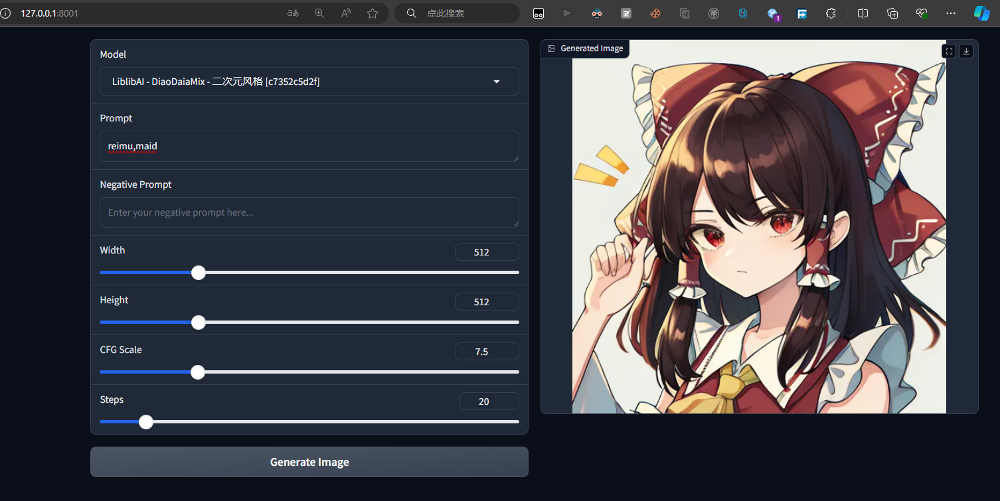
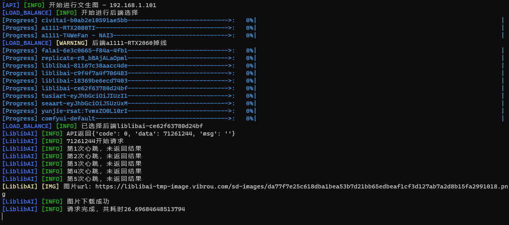
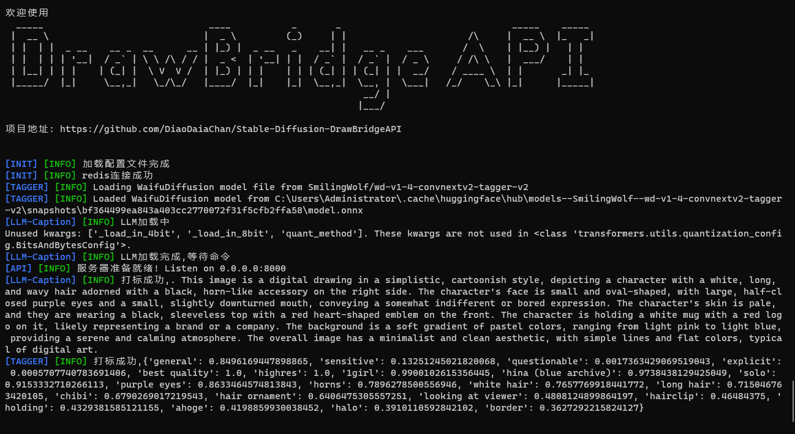
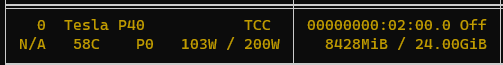

# Calling Various Online AI Drawing Website APIs With a Simple Gradio UI

## API Compatible with A1111webui API

https://github.com/AUTOMATIC1111/stable-diffusion-webui/wiki/API

## 如果有需要适配的后端欢迎留下个issue,会进行适配.
### If you have any backends that need to be adapted, please feel free to leave an issue, and I will work on the adaptation.
## 之后项目会进行完善,我会写一些API调用教程.
### After the project is completed, I will write some API call tutorials.

## [中文说明](README_ZH.md)
This project plans to implement i18n. (woking on it)
## 
checkpoint by/模型 https://huggingface.co/nyanko7/flux-dev-anime-cg

## Environment Requirements: Python 3.10 and Redis

## Features
- A Simple Gradio GUI, You can change your model here(Running on FastAPI port + 1)

- Multi-backend load balancing

- Automatic locking for backends that do not support concurrency
- Built-in caption feature(https://github.com/toriato/stable-diffusion-webui-wd14-tagger), currently supporting natural language tagging (CUDA/8G VRAM) and wd tagger


## Supported Backends
- https://github.com/AUTOMATIC1111/stable-diffusion-webui
- https://civitai.com/
- https://fal.ai/models/fal-ai/flux/schnell
- https://replicate.com/black-forest-labs/flux-schnell
- https://www.liblib.art/
- https://tusiart.com/
- https://www.seaart.ai/
- https://www.yunjie.art/
- https://github.com/comfyanonymous/ComfyUI

### Deployment Guide (For Windows CMD)
### You need to deploy a Redis server on the server! Please install it yourself.

Python 3.10
```
git clone https://github.com/DiaoDaiaChan/Stable-Diffusion-DrawBridgeAPI
cd Stable-Diffusion-DrawBridgeAPI
```

#### Install Dependencies
```
python -m venv venv
.\venv\Scripts\python -m pip install -r .\requirements.txt
```

#### Modify Configuration File
Copy `config_example.yaml` to `config.yaml`.
[See Detailed Instructions](DrawBridgeAPI/config_example.yaml)

#### Start
Please note that the working directory must be the `DrawBridgeAPI` directory!
```
cd DrawBridgeAPI
..\venv\Scripts\python api_server.py --port=8000 --host=127.0.0.1
```

#### Access
Visit http://localhost:8000/docs# for help.

#### Warning
The API currently has no authentication; do not expose this API to the public, or it may be abused.

Testing with CURL
```
curl -X POST -H "Content-Type: application/json" -d '{"prompt": "reimu", "width": 512, "height": 768}' http://localhost:8000/sdapi/v1/txt2img
```
..\venv\Scripts\python api_server.py --port=8000 --host=127.0.0.1

#### Optional Service
Start the built-in tagging server.
Set `server_settings - build_in_tagger` to true in the `config.yaml` file to start it, and install the dependencies.

If the working directory is `Stable-Diffusion-DrawBridgeAPI\DrawBridgeAPI`:
```
..\venv\Scripts\python -m pip install -r utils/tagger-requirements.txt
```
## TODO
- A simple frontend for easy drawing, tagging, and other operations.
## Changelog

### 2024-08-28
Updated to use LLM for natural language image tagging, adapted from https://github.com/StartHua/Comfyui_CXH_joy_caption.
Note: Requires GPU and 8G VRAM.

```angular2html
  build_in_tagger:
    true
  llm_caption:  # Use LLM for natural language tagging
    enable:
      true
    clip:
      google/siglip-so400m-patch14-384
    llm:
      unsloth/Meta-Llama-3.1-8B-bnb-4bit
    image_adapter: # https://huggingface.co/spaces/fancyfeast/joy-caption-pre-alpha/tree/main/wpkklhc6
      image_adapter.pt
```
Dependencies are in llm_caption_requirements.txt