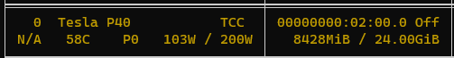

# 调用各种在线AI绘图网站的API以及一个简易GUI
本项目计划进行i18n  
[[English]](README.md)

## 兼容A1111webui API的API  
https://github.com/AUTOMATIC1111/stable-diffusion-webui/wiki/API
## 
checkpoint by/模型 https://huggingface.co/nyanko7/flux-dev-anime-cg
## 环境要求  
Python 3.10 和 Redis

## 特性  
- Gradio 简易UI（端口号为FastAPI端口号+1），可以更换模型  

- 多后端负载均衡  

- 不支持并发的后端自动上锁
- 自带打标功能，现在支持自然语言打标（CUDA/8G VRAM）以及 wd tagger  


## 已经适配的后端  
- https://github.com/AUTOMATIC1111/stable-diffusion-webui
- https://civitai.com/
- https://fal.ai/models/fal-ai/flux/schnell
- https://replicate.com/black-forest-labs/flux-schnell
- https://www.liblib.art/
- https://tusiart.com/
- https://www.seaart.ai/
- https://www.yunjie.art/
- https://github.com/comfyanonymous/ComfyUI

## QQ群 575601916

### 部署教程（以下为Windows CMD）  
### 需要在服务器上部署Redis服务器！请自行安装

Python 3.10
```
git clone https://github.com/DiaoDaiaChan/Stable-Diffusion-DrawBridgeAPI
cd Stable-Diffusion-DrawBridgeAPI
```

#### 安装依赖  
```
python -m venv venv
.\venv\Scripts\python -m pip install -r .\requirements.txt
```

#### 更改配置文件  
复制 `config_example.yaml` 为 `config.yaml`  
[查看详细说明](DrawBridgeAPI/config_example.yaml)

#### 启动  
请注意工作目录必须是 `DrawBridgeAPI` 目录！  
```
cd DrawBridgeAPI
..\venv\Scripts\python api_server.py --port=8000 --host=127.0.0.1
```

#### 访问  
访问 http://localhost:8000/docs# 获取帮助

#### 注意  
目前API没有鉴权，请勿将此API暴露在公网，否则可能会被滥用。

使用CURL测试
```
curl -X POST -H "Content-Type: application/json" -d '{"prompt": "reimu", "width": 512, "height": 768}' http://localhost:8000/sdapi/v1/txt2img
```

#### 可选服务  
启动服务器自带打标服务器。  
修改 `config.yaml` 文件 `server_settings - build_in_tagger` 为 `true` 启动，安装依赖。

假如工作路径为 `Stable-Diffusion-DrawBridgeAPI\DrawBridgeAPI`:
```
..\venv\Scripts\python -m pip install -r utils/tagger-requirements.txt
```

### TODO  
简单的前端，方便进行画图、打标等操作。

### 更新日志  
### 2024-08-28  
更新了使用LLM对图片进行自然语言打标，改自 https://github.com/StartHua/Comfyui_CXH_joy_caption  
注意：需要GPU以及8G显存  

```yaml
  build_in_tagger:
    false
  llm_caption:  # 使用LLM用自然语言打标
    enable:
      true
    clip:
      google/siglip-so400m-patch14-384
    llm:
      unsloth/Meta-Llama-3.1-8B-bnb-4bit
    image_adapter: # https://huggingface.co/spaces/fancyfeast/joy-caption-pre-alpha/tree/main/wpkklhc6
      image_adapter.pt
```
依赖文件在 `llm_caption_requirements.txt`
